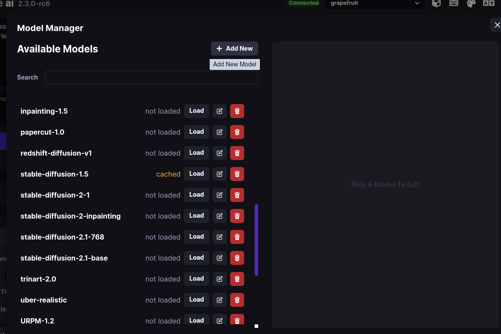
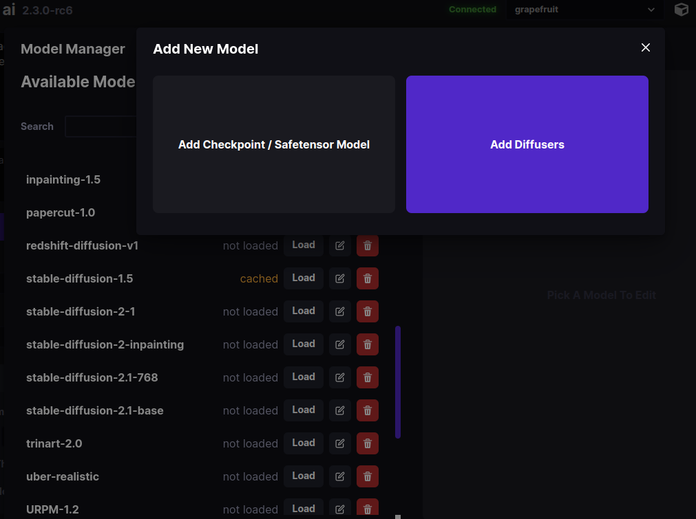
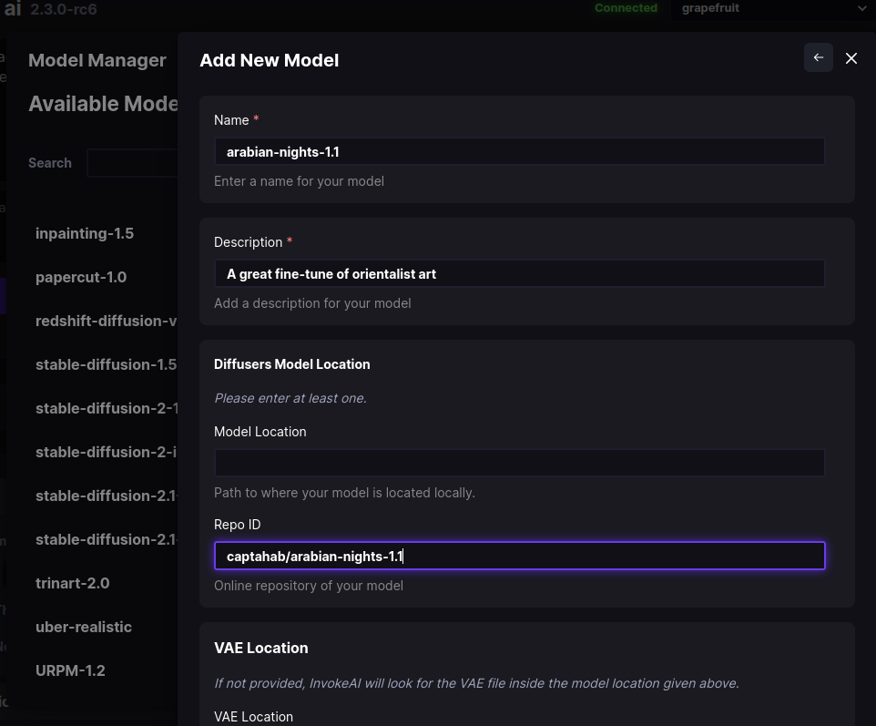
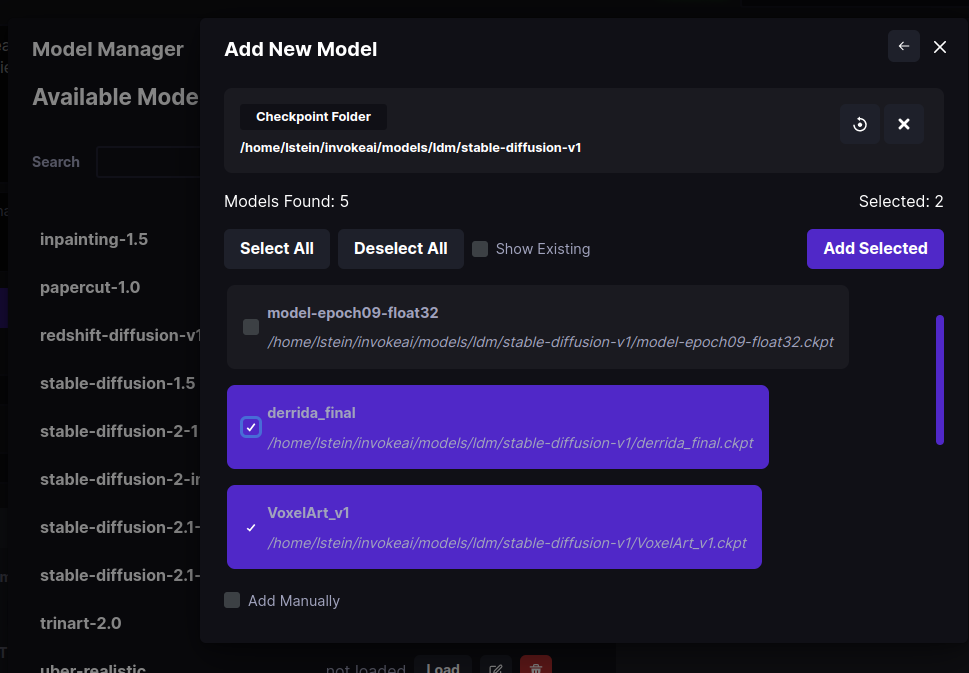

# :octicons-paintbrush-16: Installing Models

## Checkpoint and Diffusers Models

The model checkpoint files ('\*.ckpt') are the Stable Diffusion
"secret sauce". They are the product of training the AI on millions of
captioned images gathered from multiple sources.

Originally there was only a single Stable Diffusion weights file,
which many people named `model.ckpt`. Now there are dozens or more
that have been fine tuned to provide particulary styles, genres, or
other features. In addition, there are several new formats that
improve on the original checkpoint format: a `.safetensors` format
which prevents malware from masquerading as a model, and `diffusers`
models, the most recent innovation.

InvokeAI supports all three formats but strongly prefers the
`diffusers` format. These are distributed as directories containing
multiple subfolders, each of which contains a different aspect of the
model. The advantage of this is that the models load from disk really
fast. Another advantage is that `diffusers` models are supported by a
large and active set of open source developers working at and with
HuggingFace organization, and improvements in both rendering quality
and performance are being made at a rapid pace. Among other features
is the ability to download and install a `diffusers` model just by
providing its HuggingFace repository ID.

While InvokeAI will continue to support `.ckpt` and `.safetensors`
models for the near future, these are deprecated and support will
likely be withdrawn at some point in the not-too-distant future.

This manual will guide you through installing and configuring model
weight files and converting legacy `.ckpt` and `.safetensors` files
into performant `diffusers` models.

## Base Models

InvokeAI comes with support for a good set of starter models. You'll
find them listed in the master models file
`configs/INITIAL_MODELS.yaml` in the InvokeAI root directory. The
subset that are currently installed are found in
`configs/models.yaml`. The current list is:

| Model                | HuggingFace Repo ID               | Description                                                | URL
| -------------------- | --------------------------------- | ---------------------------------------------------------- | -------------------------------------------------------------- |
| stable-diffusion-1.5 | runwayml/stable-diffusion-v1-5    | Most recent version of base Stable Diffusion model         | https://huggingface.co/runwayml/stable-diffusion-v1-5          |
| stable-diffusion-1.4 | runwayml/stable-diffusion-v1-4    | Previous version of base Stable Diffusion model         | https://huggingface.co/runwayml/stable-diffusion-v1-4          |
| inpainting-1.5       | runwayml/stable-diffusion-inpainting  | Stable diffusion 1.5 optimized for inpainting          | https://huggingface.co/runwayml/stable-diffusion-inpainting    |
| stable-diffusion-2.1-base |stabilityai/stable-diffusion-2-1-base | Stable Diffusion version 2.1 trained on 512 pixel images | https://huggingface.co/stabilityai/stable-diffusion-2-1-base |
| stable-diffusion-2.1-768 |stabilityai/stable-diffusion-2-1 | Stable Diffusion version 2.1 trained on 768 pixel images | https://huggingface.co/stabilityai/stable-diffusion-2-1        |
| dreamlike-diffusion-1.0  | dreamlike-art/dreamlike-diffusion-1.0  | An SD 1.5 model finetuned on high quality art    | https://huggingface.co/dreamlike-art/dreamlike-diffusion-1.0   |
| dreamlike-photoreal-2.0  | dreamlike-art/dreamlike-photoreal-2.0  | A photorealistic model trained on 768 pixel images| https://huggingface.co/dreamlike-art/dreamlike-photoreal-2.0   |
| openjourney-4.0      | prompthero/openjourney              | An SD 1.5 model finetuned on Midjourney images prompt with "mdjrny-v4 style"   | https://huggingface.co/prompthero/openjourney  |
| nitro-diffusion-1.0  | nitrosocke/Nitro-Diffusion          | An SD 1.5 model finetuned on three styles, prompt with "archer style", "arcane style" or "modern disney style" | https://huggingface.co/nitrosocke/Nitro-Diffusion|
| trinart-2.0          | naclbit/trinart_stable_diffusion_v2 | An SD 1.5 model finetuned with ~40,000 assorted high resolution manga/anime-style pictures | https://huggingface.co/naclbit/trinart_stable_diffusion_v2|
| trinart-characters-2_0 | naclbit/trinart_derrida_characters_v2_stable_diffusion | An SD 1.5 model finetuned with 19.2M manga/anime-style pictures | https://huggingface.co/naclbit/trinart_derrida_characters_v2_stable_diffusion|

Note that these files are covered by an "Ethical AI" license which forbids
certain uses. When you initially download them, you are asked to
accept the license terms.

## Community-Contributed Models

There are too many to list here and more are being contributed every
day.  [HuggingFace](https://huggingface.co/models?library=diffusers)
is a great resource for diffusers models, and is also the home of a
[fast-growing repository](https://huggingface.co/sd-concepts-library)
of embedding (".bin") models that add subjects and/or styles to your
images. The latter are automatically installed on the fly when you
include the text `<concept-name>` in your prompt. See [Concepts
Library](../features/CONCEPTS.md) for more information.

Another popular site for community-contributed models is
[CIVITAI](https://civitai.com). This extensive site currently supports
only `.safetensors` and `.ckpt` models, but they can be easily loaded
into InvokeAI and/or converted into optimized `diffusers` models. Be
aware that CIVITAI hosts many models that generate NSFW content.

## Installation

There are multiple ways to install and manage models:

1. The `invokeai-configure` script which will download and install them for you.

2. The command-line tool (CLI) has commands that allows you to import, configure and modify
   models files.

3. The web interface (WebUI) has a GUI for importing and managing
models.

### Installation via `invokeai-configure`

From the `invoke` launcher, choose option (6) "re-run the configure
script to download new models." This will launch the same script that
prompted you to select models at install time. You can use this to add
models that you skipped the first time around. It is all right to
specify a model that was previously downloaded; the script will just
confirm that the files are complete.

### Installation via the CLI

You can install a new model, including any of the community-supported ones, via
the command-line client's `!import_model` command.

#### Installing `.ckpt` and `.safetensors` models

If the model is already downloaded to your local disk, use
`!import_model /path/to/file.ckpt` to load it. For example:

```bash
invoke> !import_model C:/Users/fred/Downloads/martians.safetensors
```

!!! tip "Forward Slashes"
    On Windows systems, use forward slashes rather than backslashes
    in your file paths.
    If you do use backslashes,
    you must double them like this:
    `C:\\Users\\fred\\Downloads\\martians.safetensors`

Alternatively you can directly import the file using its URL:

```bash
invoke> !import_model https://example.org/sd_models/martians.safetensors
```

For this to work, the URL must not be password-protected. Otherwise
you will receive a 404 error.

When you import a legacy model, the CLI will ask you a few questions
about the model, including what size image it was trained on (usually
512x512), what name and description you wish to use for it, what
configuration file to use for it (usually the default
`v1-inference.yaml`), whether you'd like to make this model the
default at startup time, and whether you would like to install a
custom VAE (variable autoencoder) file for the model. For recent
models, the answer to the VAE question is usually "no," but it won't
hurt to answer "yes".

#### Installing `diffusers` models

You can install a `diffusers` model from the HuggingFace site using
`!import_model` and the HuggingFace repo_id for the model:

```bash
invoke> !import_model andite/anything-v4.0
```

Alternatively, you can download the model to disk and import it from
there. The model may be distributed as a ZIP file, or as a Git
repository:

```bash
invoke> !import_model C:/Users/fred/Downloads/andite--anything-v4.0
```

!!! tip "The CLI supports file path autocompletion"
         Type a bit of the path name and hit ++tab++ in order to get a choice of
         possible completions.

!!! tip "On Windows, you can drag model files onto the command-line"
         Once you have typed in `!import_model `, you can drag the
         model  file or directory onto the command-line to insert the model path. This way, you don't need to
         type it or copy/paste. However, you will need to reverse or
         double backslashes as noted above.

Before installing, the CLI will ask you for a short name and
description for the model, whether to make this the default model that
is loaded at InvokeAI startup time, and whether to replace its
VAE. Generally the answer to the latter question is "no".

### Converting legacy models into `diffusers`

The CLI `!convert_model` will convert a `.safetensors` or `.ckpt`
models file into `diffusers` and install it.This will enable the model
to load and run faster without loss of image quality.

The usage is identical to `!import_model`. You may point the command
to either a downloaded model file on disk, or to a (non-password
protected) URL:

```bash
invoke> !convert_model C:/Users/fred/Downloads/martians.safetensors
```

After a successful conversion, the CLI will offer you the option of
deleting the original `.ckpt` or `.safetensors` file.

### Optimizing a previously-installed model

Lastly, if you have previously installed a `.ckpt` or `.safetensors`
file and wish to convert it into a `diffusers` model, you can do this
without re-downloading and converting the original file using the
`!optimize_model` command. Simply pass the short name of an existing
installed model:

```bash
invoke> !optimize_model martians-v1.0
```

The model will be converted into `diffusers` format and replace the
previously installed version. You will again be offered the
opportunity to delete the original `.ckpt` or `.safetensors` file.

### Related CLI Commands

There are a whole series of additional model management commands in
the CLI that you can read about in [Command-Line
Interface](../features/CLI.md). These include:

* `!models` - List all installed models
* `!switch <model name>` - Switch to the indicated model
* `!edit_model <model name>` - Edit the indicated model to change its name, description or other properties
* `!del_model <model name>` - Delete the indicated model

### Manually editing `configs/models.yaml`

If you are comfortable with a text editor then you may simply edit `models.yaml`
directly.

You will need to download the desired `.ckpt/.safetensors` file and
place it somewhere on your machine's filesystem. Alternatively, for a
`diffusers` model, record the repo_id or download the whole model
directory. Then using a **text** editor (e.g. the Windows Notepad
application), open the file `configs/models.yaml`, and add a new
stanza that follows this model:

#### A legacy model

A legacy `.ckpt` or `.safetensors` entry will look like this:

```yaml
arabian-nights-1.0:
  description: A great fine-tune in Arabian Nights style
  weights: ./path/to/arabian-nights-1.0.ckpt
  config: ./configs/stable-diffusion/v1-inference.yaml
  format: ckpt
  width: 512
  height: 512
  default: false
```

Note that `format` is `ckpt` for both `.ckpt` and `.safetensors` files.

#### A diffusers model

A stanza for a `diffusers` model will look like this for a HuggingFace
model with a repository ID:

```yaml
arabian-nights-1.1:
  description: An even better fine-tune of the Arabian Nights
  repo_id: captahab/arabian-nights-1.1
  format: diffusers
  default: true
```

And for a downloaded directory:

```yaml
arabian-nights-1.1:
  description: An even better fine-tune of the Arabian Nights
  path: /path/to/captahab-arabian-nights-1.1
  format: diffusers
  default: true
```

There is additional syntax for indicating an external VAE to use with
this model. See `INITIAL_MODELS.yaml` and `models.yaml` for examples.

After you save the modified `models.yaml` file relaunch
`invokeai`. The new model will now be available for your use.

### Installation via the WebUI

To access the WebUI Model Manager, click on the button that looks like
a cute in the upper right side of the browser screen. This will bring
up a dialogue that lists the models you have already installed, and
allows you to load, delete or edit them:

<figure markdown>

</figure>

To add a new model, click on **+ Add New** and select to either a
checkpoint/safetensors model, or a diffusers model:

<figure markdown>

</figure>

In this example, we chose **Add Diffusers**. As shown in the figure
below, a new dialogue prompts you to enter the name to use for the
model, its description, and either the location of the `diffusers`
model on disk, or its Repo ID on the HuggingFace web site. If you
choose to enter a path to disk, the system will autocomplete for you
as you type:

<figure markdown>

</figure>

Press **Add Model** at the bottom of the dialogue (scrolled out of
site in the figure), and the model will be downloaded, imported, and
registered in `models.yaml`.

The **Add Checkpoint/Safetensor Model** option is similar, except that
in this case you can choose to scan an entire folder for
checkpoint/safetensors files to import. Simply type in the path of the
directory and press the "Search" icon. This will display the
`.ckpt` and `.safetensors` found inside the directory and its
subfolders, and allow you to choose which ones to import:

<figure markdown>

</figure>

## Model Management Startup Options

The `invoke` launcher and the `invokeai` script accept a series of
command-line arguments that modify InvokeAI's behavior when loading
models. These can be provided on the command line, or added to the
InvokeAI root directory's `invokeai.init` initialization file.

The arguments are:

* `--model <model name>` -- Start up with the indicated model loaded
* `--ckpt_convert` -- When a checkpoint/safetensors model is loaded, convert it into a `diffusers` model in memory. This does not permanently save the converted model to disk.
* `--autoconvert <path/to/directory>` -- Scan the indicated directory path for new checkpoint/safetensors files, convert them into `diffusers` models, and import them into InvokeAI.

Here is an example of providing an argument on the command line using
the `invoke.sh` launch script:

```bash
invoke.sh --autoconvert /home/fred/stable-diffusion-checkpoints
```

And here is what the same argument looks like in `invokeai.init`:

```
--outdir="/home/fred/invokeai/outputs
--no-nsfw_checker
--autoconvert /home/fred/stable-diffusion-checkpoints
```

